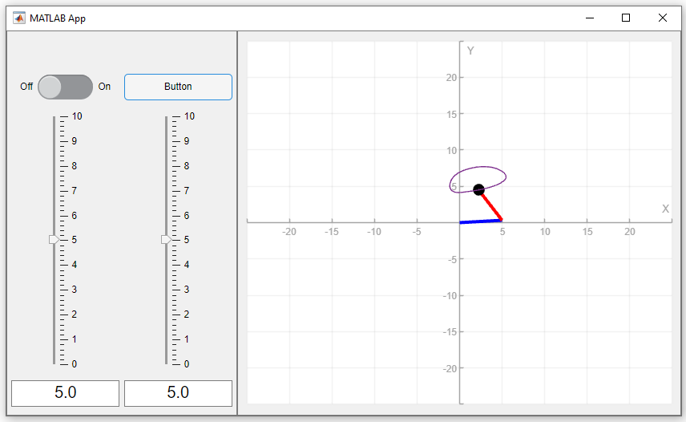

 Simple Robotics Simulation application

Users can input the lengths of two links into the Simple Robotics Simulation application to watch the robot move over a set simulation duration. Two arms draw an ellipse.
